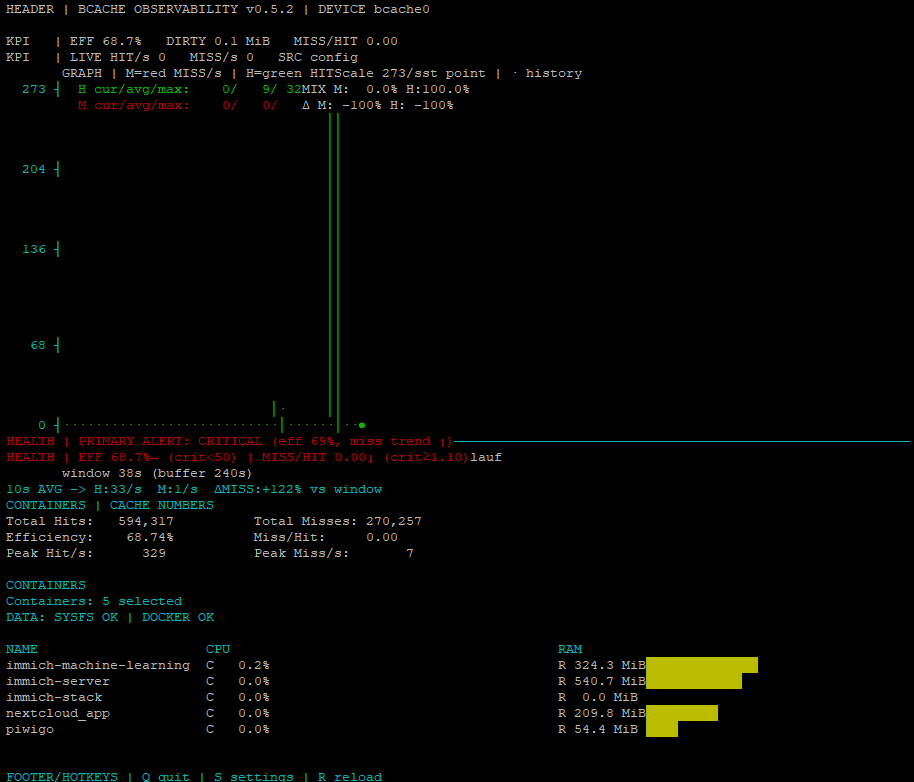

# 🚀 Linux Bcache Monitor

A lightweight and fast **Linux bcache monitoring tool** for real-time performance analysis, IO statistics, and cache diagnostics.

> Perfect for homelabs, servers, and SSD + HDD cache setups.

---

## ✨ Features

- 📊 Real-time bcache statistics
- ⚡ Monitor SSD cache performance
- 💾 Analyze HDD + SSD hybrid setups
- 🧠 Simple CLI interface (no dependencies)
- 🔍 Detect IO bottlenecks
- 🐧 Works on all major Linux distributions

---

## 📸 Preview



---

## 🧩 What is bcache?

**bcache** is a Linux kernel block layer that allows using an SSD as a cache for slower HDDs.

This tool helps you monitor:

- Cache hit ratio
- IO throughput
- Device performance
- System bottlenecks

---

## 🚀 Installation

Dieses `curl` lädt die Datei in den **aktuellen Pfad** und macht sie direkt ausführbar:

```bash
curl -fsSL https://raw.githubusercontent.com/fabianschmeltzer/Linux-Bcache-Monitor/main/bcache-monitor -o ./bcache-monitor && chmod +x ./bcache-monitor
```
