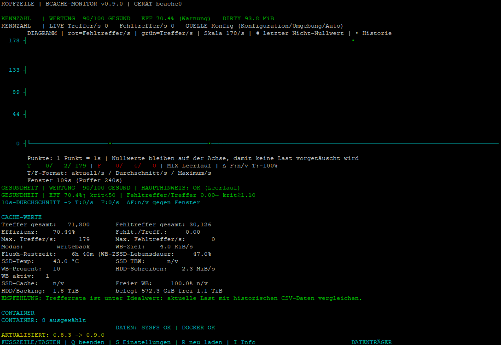

# 🚀 Linux Bcache Monitor

A lightweight and fast **Linux bcache monitoring tool** for real-time performance analysis, IO statistics, and cache diagnostics.

> Perfect for homelabs, servers, and SSD + HDD cache setups.

---

## ✨ Features

- 📊 Real-time bcache statistics
- ⚡ Monitor SSD cache performance
- 💾 Analyze HDD + SSD hybrid setups
- 🧠 Simple CLI interface (no dependencies)
- 🔍 Detect IO bottlenecks
- 🧮 Health-Score (0–100) with automatic recommendations
- 🧾 Historical CSV samples for trend analysis
- 🌡️ SSD SMART/NVMe health: wear, remaining life, TBW, and temperature when `smartctl` or `nvme` is available
- ⚠️ Writeback risk view with dirty-data flush ETA
- 📈 Prometheus text output via `--prometheus` / `--metrics`
- 🐧 Works on all major Linux distributions

---

## 📸 Preview



---

## 🧩 What is bcache?

**bcache** is a Linux kernel block layer that allows using an SSD as a cache for slower HDDs.

This tool helps you monitor:

- Cache hit ratio and qualitative cache efficiency
- IO throughput
- Device performance
- System bottlenecks
- SSD cache wear, life remaining, TBW, and temperature
- Writeback risk and estimated flush duration
- Health score, warnings, and recommendations

---

## 🚀 Installation

This `curl` downloads the file to the **current path** and makes it executable immediately:

```bash
curl -fsSL https://raw.githubusercontent.com/fabianschmeltzer/Linux-Bcache-Monitor/main/bcache-monitor -o ./bcache-monitor && chmod +x ./bcache-monitor
```

---


## 📤 Prometheus / Metrics mode

Print one Prometheus-compatible metrics snapshot without starting the curses dashboard:

```bash
./bcache-monitor --prometheus
```

Example metrics include `bcache_hit_ratio`, `bcache_dirty_bytes`, `bcache_cache_available_percent`, `bcache_state`, `bcache_health_score`, `bcache_ssd_life_remaining_percent`, `bcache_ssd_temperature_celsius`, and `bcache_ssd_total_bytes_written`.

## 🗂️ Historical statistics

The dashboard appends CSV samples to `~/.local/share/bcache-monitor/history.csv` on periodic refresh. Override the target path with:

```bash
BCACHE_MONITOR_HISTORY_CSV=/var/lib/bcache-monitor/history.csv ./bcache-monitor
```

This history can reveal falling hit rates, growing dirty-data backlogs, or workload changes over time.

## 🩺 SSD health requirements

SSD/NVMe health is optional and depends on local tools and permissions:

- NVMe: `nvme smart-log /dev/<cache-device>`
- SATA/SAS SSD: `smartctl -A /dev/<cache-device>`

If these tools are missing or the process lacks permission, the dashboard keeps running, displays `N/A` for the affected SSD fields, and prints an on-screen `HINWEIS` with the missing command or permission problem.

## 🧰 Optional dependency hints

The core bcache counters are read from Linux sysfs and do not need extra Python packages. Some extended values need local command-line tools:

- Container CPU/MEM/DISK values require the Docker CLI command `docker`.
- NVMe SSD health values require `nvme` from `nvme-cli`.
- SATA/SAS SSD health values require `smartctl` from `smartmontools`.

When one of these commands is missing, fails, or times out, the dashboard keeps running and shows a yellow `HINWEIS` line explaining which dependency or permission should be checked.

## ℹ️ Info, credits, and legal notes

- **Version:** 0.7.00
- **Credits:** by Fabian Schmeltzer
- **AI note:** This program was written with AI assistance and may contain errors. Please verify critical output and use this tool at your own risk.
- **Bug reports:** Please submit bugs and improvement suggestions via GitHub Issues: <https://github.com/fabianschmeltzer/Linux-Bcache-Monitor/issues>
- **Legal note:** This is not legal advice. Without an explicit open-source license, standard copyright rules generally apply; GitHub documents that public repositories without a license can be viewed and forked on GitHub, but broader use, distribution, or derivative works require an appropriate license or permission. For binding guidance, consult legal counsel.

## 📖 What do the values mean?

- **EFF:** Cache efficiency from `Total Hits / (Total Hits + Total Misses)`. Low values indicate many accesses are not served by SSD cache.
- **DIRTY:** Amount of data in cache that still needs to be written to the HDD/backing device. Especially important in writeback mode.
- **MISS/HIT:** Ratio of current misses per second to hits per second. Values around `1.0` or higher mean at least as many requests bypass cache as are served by it.
- **LIVE HIT/s and MISS/s:** Live per-second change rate of bcache counters.
- **GRAPH:** Red shows `MISS/s`, green shows `HIT/s`; `◆` marks the newest point, `•` older points.
- **H/M current/avg/peak:** Current value, window average, and peak value.
- **MIX:** Percentage share of current bcache events. `M` is miss share, `H` is hit share. With no load, the tool shows `MIX idle` because percentages would be misleading.
- **Δ / DELTA:** Comparison of current value with window average. If average is `0`, `n/a` is shown.
- **HEALTH / SCORE:** Traffic-light assessment plus a 0–100 score from efficiency, cache mode, writeback risk, dirty data, and SSD health.
- **SSD cache / Avail WB:** Cache size and potentially available cache share for writeback, when readable from sysfs.
- **HDD/backing:** Size of the bcache block device and, if mounted, used/free filesystem space.
- **Flush ETA:** Estimated dirty-data drain time from dirty bytes and writeback/HDD write rate.
- **SSD life / SSD temp / SSD TBW:** Optional SMART/NVMe cache device health values.
- **WB target:** Background writeback rate (`writeback_rate`) reported by bcache in bytes/s. This is bcache's throttle/target rate and not necessarily identical to physical HDD I/O.
- **WB percent / WB running:** Target share for dirty data and status indicating whether bcache background writeback is running.
- **HDD write:** Real backing-device write rate calculated from `/sys/block/<device>/stat` between two samples. Helps show whether dirty data is actually draining to HDD.
- **Docker DISK:** Read and write rates from Docker `BlockIO` deltas since the last Docker refresh. The last calculated rate remains visible until a new Docker sample is available.

Reference sources: The [Linux kernel documentation](https://docs.kernel.org/admin-guide/bcache.html) describes bcache sysfs values such as `dirty_data`, `writeback_percent`, `writeback_rate`, `cache_available_percent`, `bucket_size`, and `nbuckets`. [GitHub Docs](https://docs.github.com/en/repositories/managing-your-repositorys-settings-and-features/customizing-your-repository/licensing-a-repository) and [Choose a License](https://choosealicense.com/no-permission/) explain the legal baseline for repositories without a license.


## ⚖️ Legal note

This is not legal advice. The tool is provided without warranty; output may be incorrect, incomplete, or outdated. Independently verify critical values before production decisions. Without an explicit open-source license, standard copyright rules generally apply; public GitHub repositories may be viewed and forked under GitHub platform terms, but broader use, distribution, or derivative works require an appropriate license or permission.

## 🙏 Credits

by Fabian Schmeltzer

This program was written with AI assistance and may contain errors. Please report bugs at <https://github.com/fabianschmeltzer/Linux-Bcache-Monitor/issues>.
